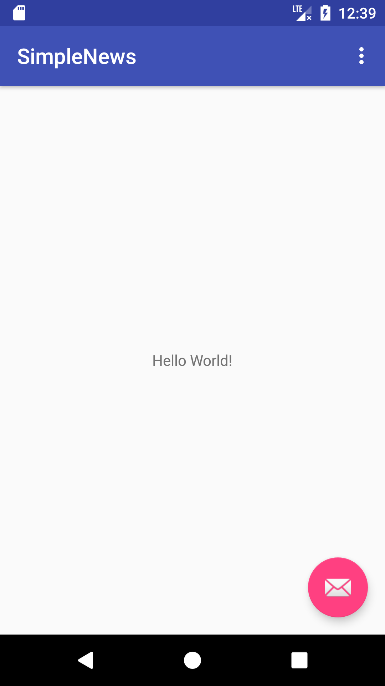
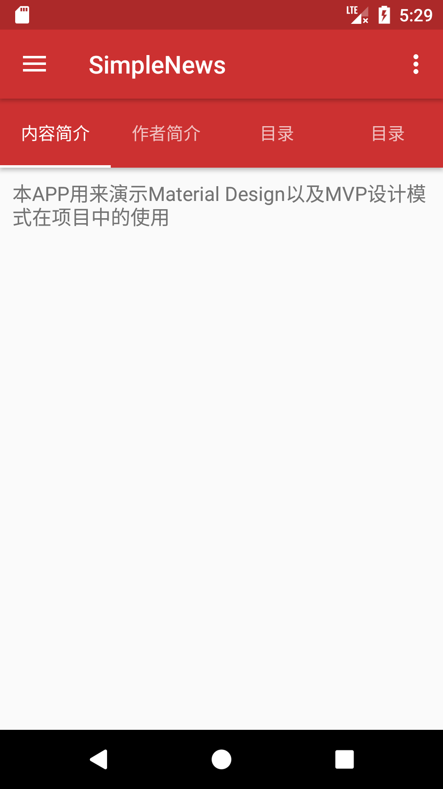

# learn-android-from-commits

> 跟着仓库提交记录学习Android开发，实现[SimpleNews](https://github.com/Gnotes/SimpleNews)项目

## 开发环境

- JDK: 1.8
- Gradle: 4.4
- Android Studio: 3.1.3
- OS: Mac

# Follow Me

## 第一章

- [初始化项目](https://github.com/Gnotes/learn-android-from-commits/commit/a450ed0f47babdf3fd8468b4f0a3c4d153439491)

打开 `Android Studio` 初始化一个Android项目 `SimpleNews`，选择 `minSdkVersion` 为 `19` ，默认会使用当前下载的最新编译版本 `compileSdkVersion` ，我的是`27`，然后选择创建一个 `Basic Activity` ，`Finish`，安装完成后可以看到初始化的项目。点击启动会展示如下界面。  

  

- [添加基础布局](https://github.com/Gnotes/learn-android-from-commits/commit/24110f1c05a3581f3dc3f69a4fb2ce5754a395a8)

添加了抽屉式布局，首页选项卡布局  

  

- [更新圆形图片依赖包到最新版本，及修改属性](https://github.com/Gnotes/learn-android-from-commits/commit/974ecddd3a954c216dbf00afd4fa41bb171480d8)

- [添加代码注释](https://github.com/Gnotes/learn-android-from-commits/commit/90ead5a6c5dfcf0d60124e9636a858489532fed6)

### 需要了解的知识点

- [Toolbar](https://www.jianshu.com/p/e9130d31ee1f) 👍
- FloatingActionButton
- [Snackbar](http://wiki.jikexueyuan.com/project/material-design/components/snackbars-and-toasts.html)
- [CoordinatorLayout](https://blog.csdn.net/jxf_access/article/details/79564669) 👍 协调布局或者黏性布局
- [AppBarLayout](https://blog.csdn.net/jxf_access/article/details/79564669) 👍
- [ConstraintLayout](https://blog.csdn.net/lmj623565791/article/details/78011599?utm_source=tuicool&utm_medium=referral) 👍 约束布局
- [xmlns](https://github.com/Gnotes/Android/blob/master/UI%E5%B8%83%E5%B1%80/xmlns.md)
- supportsRtl
- roundIcon
- apply plugin: 'com.android.application'
- apply plugin: 'com.android.library'
- [com.android.support:appcompat-v*:*](https://blog.csdn.net/u010015108/article/details/52459890) [another blog](https://www.jb51.net/article/65520.htm)
- com.android.support.constraint:constraint-layout:*
- com.android.support:design:*
- [RecyclerView使用详解](https://blog.csdn.net/yuminfeng728/article/details/52020708)
- [Fragment](https://github.com/Gnotes/Android/tree/master/Fragment)
- [LayoutInflater](http://www.runoob.com/w3cnote/android-tutorial-layoutinflater.html) 用于解析(实例化)Layout XML文件(布局XML文件)生成对应的 View对象
- [ActionBarDrawerToggle](https://blog.csdn.net/chaoshenzhaoxichao/article/details/79007918)
- [NavigationView](https://blog.csdn.net/hj2drf/article/details/77017284) 导航视图
- [ViewPager](http://www.runoob.com/w3cnote/android-tutorial-viewpager.html)
- [View Identification](https://github.com/Gnotes/Android/tree/master/UI%E5%B8%83%E5%B1%80#view-identification)

## 其他知识点

Android Studio  

模拟器截屏：`cmd + s` 生成代码 `cmd + n` 生成构造 `cmd + o`

## 基础储备

- [Material Design](http://wiki.jikexueyuan.com/project/material-design/)
- [Android 全知识](http://wiki.jikexueyuan.com/list/android/)
- [Android基础入门教程](http://www.runoob.com/w3cnote/android-tutorial-intro.html)
